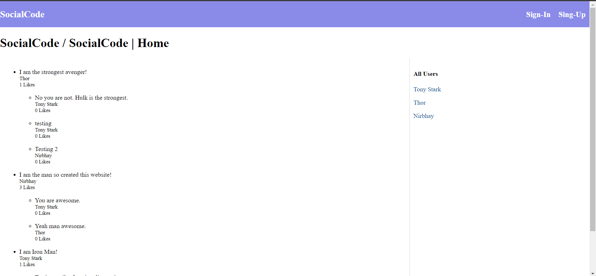
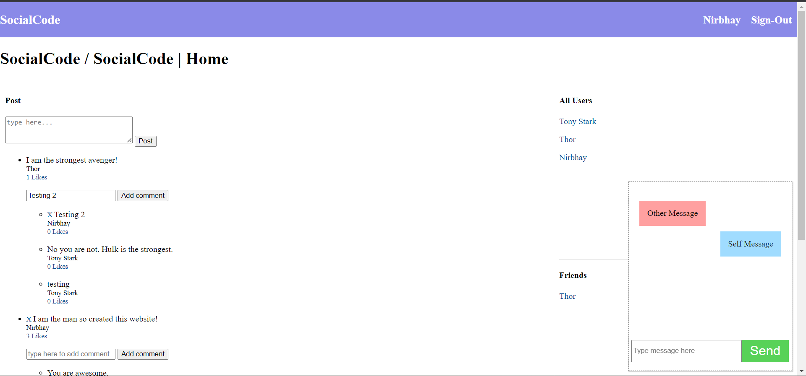
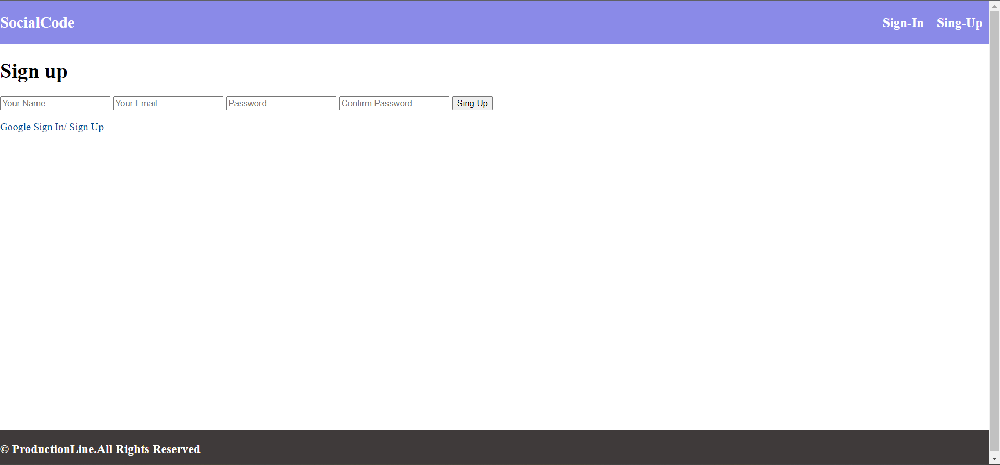
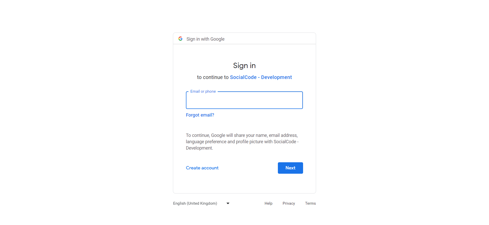
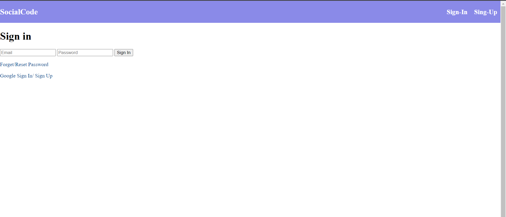
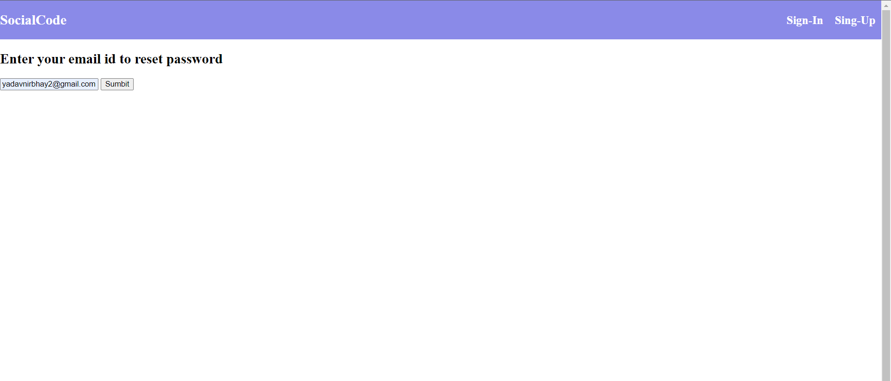
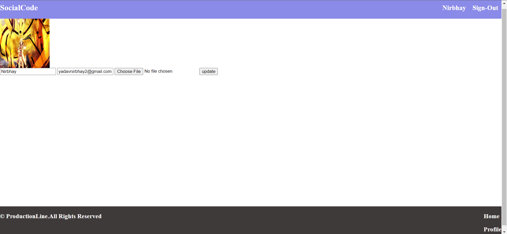
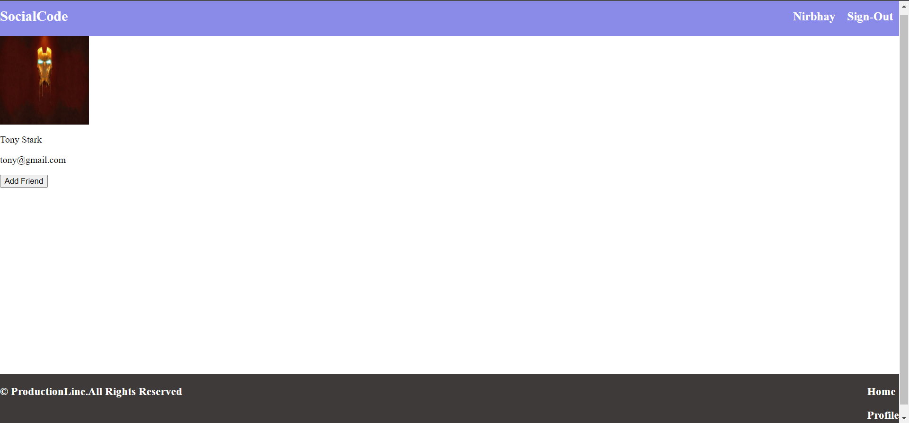
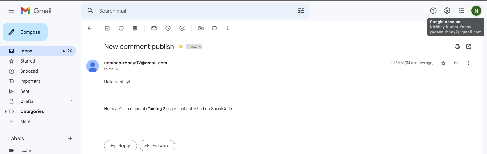

SOCIALCODE.

SocialCode is web-platform where use can share there contents like post, articles and etc.
User can then provide comments on the post, like the post or the comments on the post.

Other Features about SocialCode
1. Chat-room included for one to one interaction.
2. Users can Sign-up/Sign-In operation.
3. Authentication for login into the socailcode application.
    1. You can create your account to login into the web application(Implemented using passortjs-local-strategy).
    2. You can also login to SocialCode using your google account(Implemented using passortjs-google-oauth2-strategy).
    3. User can also reset his password by clicking on the reset/forgot password option(on click reset/forget password a mail will sent to user registered mail account with link to reset password, NOTE: Link will expire after one use).
4. Authorization: Only user which have signed up and sign-in to SocialCode can perform below listed activities to his profile and content only.
    1. Can create a new Post, Comment or Like.
    2. Can delete a post, comment or like made by the same user.
    3. Update his profile details in the profile page(like name change, Display Pic, email.id)
    4. Can sent friend request to other user's of SocialCode application by going to other users profile page and clicking on Add friend button.
5. Pop-up alert will be displayed for each administravtive task performed on SocialCode Application(Like posting a content, commenting of content, deleting the content and etc.)
6. Mail notification for each comment posted by the user.

IMAGES OF SOCIALCODE WEB-APPLICATION.

1. Homepage(When user in not logged in.).

2. Homepage(When user is logged in.).

2. Sign-Up Page

3. Sign-up using google account.

4. Sing-In Page/ Sign-In using googel account.

5. Forget Password Page

6. Mail Sent to reset Your password.

7. Reset Password Page(This page will open when you click to link sent on mail for forget password)

8. Your Profile Page(Here you can edit your details while you are logged in).

9. Other User Profile Page(CLick on Add friend to add in your friedn list and show it in your friends list).

10. Notification recieved for each administrative actions.

11. Mail recieved to user if they post a comment.
